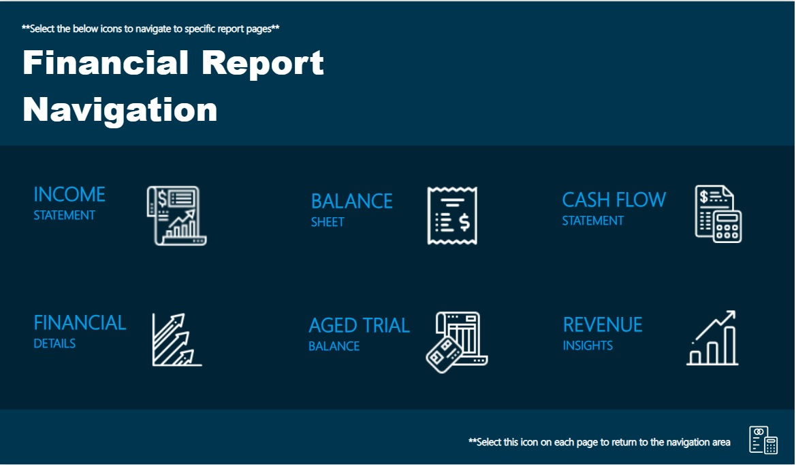
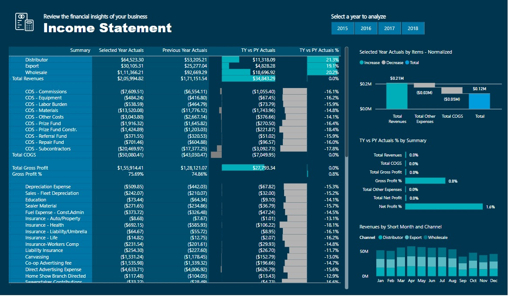
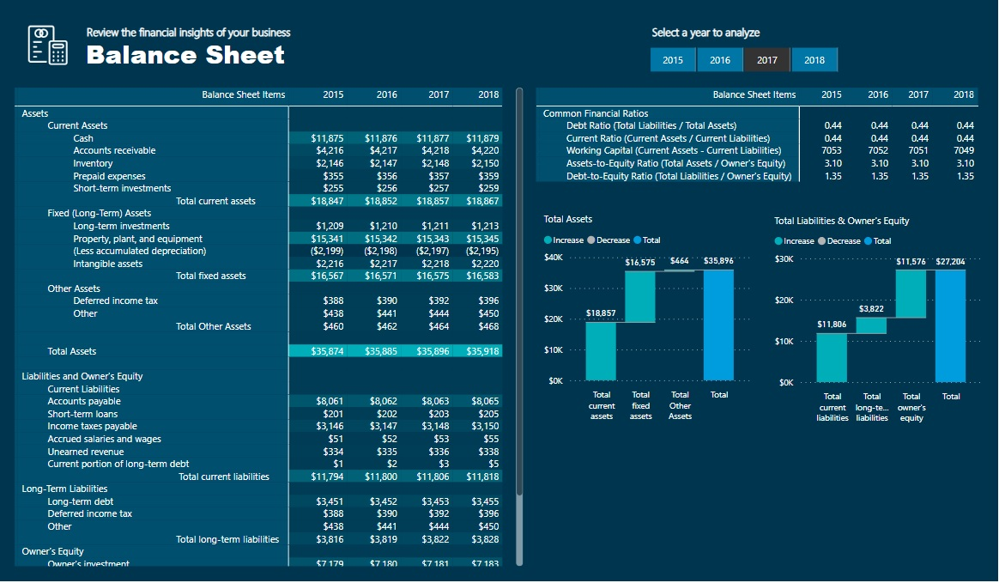
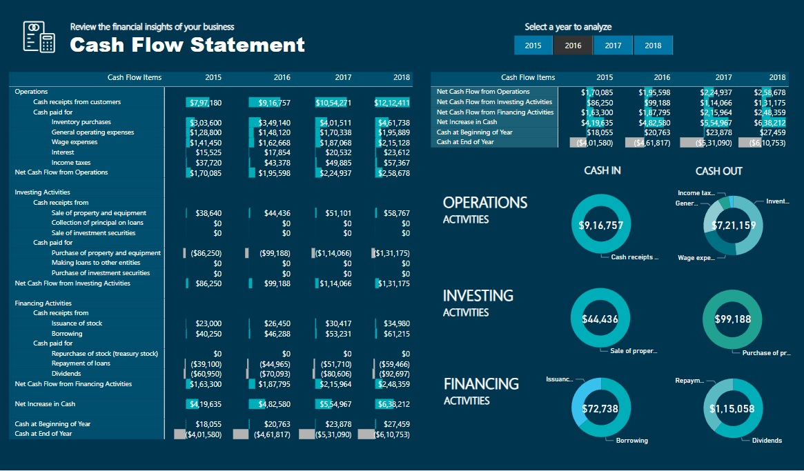

# Financial Reporting in Power BI

### 1. Description:
This project focuses on creating comprehensive financial reports using Power BI, leveraging Data Analysis Expressions (DAX), Excel data, and provided templates. The financial reports include detailed Balance Sheet, Income Statement, and Cash Flow Statement, offering stakeholders a visually-rich and insightful overview of the company's financial health.

### 2. Key Features:

i) Dynamic Data Analysis: Utilized Power BI's DAX language to perform dynamic data analysis, enabling stakeholders to interactively explore financial data.

ii) Excel Data Integration: Incorporated Excel data seamlessly into Power BI, ensuring accuracy and consistency in financial reporting.

iii) Template Utilization: Employed templates for designing and structuring financial statements, enhancing report consistency and presentation.

iV)Visual Representation: Implemented visually appealing charts and graphs to represent financial data trends, aiding in better decision-making.

v) Insightful Dashboards: Created interactive and informative dashboards providing a holistic view of the company's financial performance.

### Objective:
The primary goal is to provide a user-friendly and insightful financial reporting system in Power BI, empowering stakeholders with the necessary tools to make informed financial decisions.

